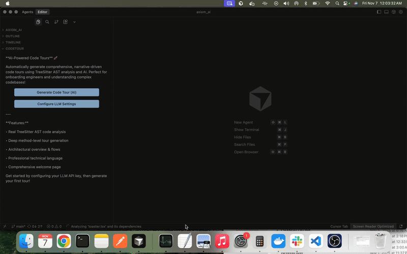

# CodeTour AI 🗺️✨

[](https://marketplace.visualstudio.com/items?itemName=saurabh-yergattikar.codetour-ai)
[](https://marketplace.visualstudio.com/items?itemName=saurabh-yergattikar.codetour-ai)
[](https://marketplace.visualstudio.com/items?itemName=saurabh-yergattikar.codetour-ai)

**Transform codebase onboarding from weeks to hours with AI-powered, narrative-driven code tours.**

CodeTour AI automatically generates comprehensive, mental-model-driven guided tours of any codebase using Repomix analysis and Large Language Models. Perfect for enterprise teams, open-source projects, and developers who want to accelerate knowledge transfer.

---

## 📦 Installation & Setup



### Install from VS Code Marketplace

1. Open VS Code Extensions (`Cmd+Shift+X` / `Ctrl+Shift+X`)
2. Search for **"CodeTour AI"**
3. Click **Install**
4. Configure your LLM API key (OpenAI, Anthropic, or custom)
5. Start generating tours! ✨

Or install via command:
```bash
ext install saurabh-yergattikar.codetour-ai
```

---

## 🎬 See It In Action


Watch CodeTour AI analyze your codebase and generate a comprehensive, narrative-driven tour that explains:
- **Project Architecture** - High-level component structure
- **Entry Points** - Where the application starts
- **Data Flow** - How information moves through the system
- **Design Patterns** - Technical decisions and trade-offs
- **Key Abstractions** - Core concepts and interfaces

---

## 🚀 Key Features

### 🤖 **AI-Powered Tour Generation**
Automatically generate comprehensive, narrative-driven code tours using **Repomix analysis** and **LLM intelligence** (OpenAI, Anthropic, or custom models). Tours explain not just *what* the code does, but *why* and *how* it works.

**What You Get:**
- ⚡ **90% faster onboarding** - Understand codebases in hours, not weeks
- 🧠 **Mental model flow** - Tours follow logical execution paths (entry → core → integrations)
- 📚 **Comprehensive overview** - Welcome page with architecture, purpose, flows, and use cases
- 🎯 **15-25 technical checkpoints** - Each with professional descriptions
- 🔄 **Parallel processing** - 10x faster generation with concurrent chunks

### 📊 **Repomix-Powered Analysis**
Unlike pattern-matching tools, CodeTour AI uses **Repomix** to generate a complete, AI-friendly summary of your entire codebase with actual line numbers. This ensures accurate, context-aware understanding.

**Benefits:**
- ✅ **Full codebase analysis** - All source files with actual line numbers
- 🔍 **Deep insights** - Understands imports, exports, and module relationships
- 🌍 **Multi-language support** - 30+ languages including TypeScript, JavaScript, Python, Go, Rust, Java
- 📦 **One-page summary** - AI-optimized XML format for efficient processing
- 🎓 **Educational quality** - Generates beginner-friendly yet technically accurate explanations

### 🏢 **Enterprise-Ready LLM Integration**
Flexible, secure integration with multiple LLM providers. Works with cloud APIs or self-hosted models.

**Supported Providers:**
- **OpenAI** - GPT-4, GPT-4o, GPT-4o-mini
- **Anthropic** - Claude 3.5 Sonnet, Claude 3 Opus
- **Custom/Self-Hosted** - Any OpenAI-compatible API (Ollama, Llama, Mistral)

**Security Features:**
- 🔐 **Secure storage** - API keys encrypted in VS Code Secret Storage
- 🚫 **No data retention** - Your code stays private
- 🏠 **Local options** - Run LLMs locally for complete privacy
- ⚙️ **Custom endpoints** - Enterprise proxy support

### 🎯 **Mental Model Tour Architecture**
Smart tour generation that creates a logical learning journey through your codebase:

**Tour Structure:**
1. **Welcome Checkpoint** - LLM analyzes codebase to generate:
   - Project purpose and goals
   - High-level architecture overview
   - Key technical flows
   - Primary use cases
   - Technology stack
   - Entry points

2. **Sequential Checkpoints** - Follow execution flow:
   - Entry point (main.ts, index.ts, etc.)
   - Core logic and abstractions
   - Data flow and transformations
   - Integration points
   - Each checkpoint explains "what", "why", "how", and "next"

**Smart Features:**
- 🧠 **Intelligent sorting** - Entry points prioritized first
- 🔗 **Connection mapping** - Shows how components interact
- ⚡ **Chunk-based processing** - 5 files per chunk to avoid rate limits
- 📈 **Progress tracking** - Real-time status during generation

---

## 🚀 Quick Start

### 1. Configure Your LLM Provider

Open VS Code and run:
- **Command Palette** (`Cmd+Shift+P`): `CodeTour: Configure LLM Settings`
- **Settings UI**: Search for "CodeTour" in VS Code settings

**Enter:**
1. API provider (OpenAI, Anthropic, or Custom)
2. API key (stored securely)
3. Model name (e.g., `gpt-4o-mini`, `claude-3-5-sonnet-20241022`)

### 2. Generate Your First Tour

**Option A: Command Palette**
1. Press `Cmd+Shift+P` (Mac) or `Ctrl+Shift+P` (Windows/Linux)
2. Run `CodeTour: Generate Code Tour (AI)`
3. Enter optional tour title and description
4. Wait 1-3 minutes for generation
5. Start exploring! 🎉

**Option B: CodeTour Panel**
1. Open Explorer sidebar
2. Find **CodeTour** panel
3. Click sparkle icon (✨)
4. Follow prompts

### 3. Navigate Your Tour

**Keyboard Shortcuts:**
- **Next Step**: `Cmd+→` (Mac) / `Ctrl+→` (Windows/Linux)
- **Previous Step**: `Cmd+←` (Mac) / `Ctrl+←` (Windows/Linux)
- **End Tour**: Click stop button or press `Esc`

**UI Controls:**
- Click steps in CodeTour panel
- Use navigation arrows in editor
- View progress in status bar

---

## 🔧 Configuration

### LLM Provider Setup

#### OpenAI (Recommended)
1. Sign up at [platform.openai.com](https://platform.openai.com)
2. Generate API key at [platform.openai.com/api-keys](https://platform.openai.com/api-keys)
3. **Recommended models:**
   - `gpt-4o-mini` - Fast, affordable ($0.15/1M tokens)
   - `gpt-4o` - Best quality ($5/1M tokens)

#### Anthropic Claude
1. Sign up at [console.anthropic.com](https://console.anthropic.com)
2. Generate API key from account settings
3. **Recommended models:**
   - `claude-3-5-sonnet-20241022` - Best balance
   - `claude-3-opus-20240229` - Highest quality

#### Custom/Self-Hosted
1. Install local LLM server (Ollama, LM Studio, etc.)
2. Set custom API URL: `http://localhost:11434/v1/chat/completions`
3. **Supported models:** Llama, Mistral, CodeLlama, Qwen

### VS Code Settings

```jsonc
{
  // LLM Configuration
  "codetour.llm.provider": "openai",
  "codetour.llm.apiKey": "your-api-key-here",
  "codetour.llm.model": "gpt-4o-mini",
  "codetour.llm.apiUrl": "https://api.openai.com/v1/chat/completions",
  
  // Display Settings
  "codetour.showMarkers": true,
  "codetour.promptForWorkspaceTours": true
}
```

---

## 🎯 How It Works

CodeTour AI uses a sophisticated multi-stage pipeline:

### 1. **Repomix Analysis** 📦
- Scans entire workspace for source files
- Generates comprehensive XML summary with:
  - Directory structure
  - File contents with line numbers
  - Import/export relationships
  - Language detection
- Auto-excludes tests, node_modules, build artifacts

### 2. **Smart File Sorting** 🎨
- Prioritizes entry points (main.ts, index.ts, app.ts)
- Sorts by importance for mental model flow
- Ensures chunk 1 contains application entry point

### 3. **Parallel Chunk Processing** ⚡
- Splits files into chunks (5 files per chunk)
- Processes 10 chunks in parallel
- Each chunk: 25 lines per file for context
- 1-second delay between batches to avoid rate limits

### 4. **LLM Tour Generation** 🤖
- **Welcome Step**: Analyzes 8-10 key files to generate:
  - Project purpose and architecture
  - Technical flows and patterns
  - Use cases and entry points
- **Code Checkpoints**: For each chunk:
  - Identifies entry point (chunk 1) or continues flow
  - Generates technical descriptions
  - Explains "what", "why", "how", "next"
  - Professional tone, no childish analogies

### 5. **Tour Assembly** ✅
- Combines all checkpoints
- Validates file paths and line numbers
- Ensures sequential flow
- Saves as `.tour` file in `.tours/` directory

---

## 💡 Supported Languages

**30+ languages** supported via Repomix:

**Web & Mobile:**
- TypeScript, JavaScript, React (TSX/JSX)
- HTML, CSS, Vue
- Swift, Kotlin, Dart

**Backend & Systems:**
- Python, Java, Go, Rust
- C/C++, C#
- Node.js, Deno

**Scripting & Other:**
- Ruby, PHP, Bash/Shell
- Elixir, Scala, Lua
- YAML, JSON, TOML

---

## 🔐 Privacy & Security

### What's Sent to the LLM

**For Welcome Page:**
- 8-10 key files (first 40 lines each)
- README content (first 2000 chars)
- File structure overview

**For Checkpoints:**
- 5 files per chunk (first 25 lines each)
- File paths and metadata
- **NOT sent**: Full file contents, secrets, credentials

### Data Storage

**API Keys:**
- Encrypted in VS Code Secret Storage
- Never included in tours or logs
- Only accessible by extension

**Tours:**
- Saved locally in `.tours/` directory
- Can be committed to Git or kept private
- No external storage unless exported

### Self-Hosted Privacy

For maximum privacy:
1. Use **local LLM** (Ollama, LM Studio)
2. Set API URL to `localhost`
3. **Your code never leaves your machine!**

---

## 🎓 Tips for Better Tours

### 1. Use Descriptive Titles
- ❌ Bad: "Tour 1"
- ✅ Good: "Authentication Flow - OAuth2 Implementation"

### 2. Generate Focused Tours
Create multiple tours for different aspects:
- "Architecture Overview"
- "API Endpoints & Routing"
- "Database Models & Queries"
- "Authentication & Authorization"
- "Frontend Components & State"

### 3. Choose the Right Model
- **Fast & Affordable**: `gpt-4o-mini` (~$0.15/tour)
- **Best Quality**: `gpt-4o`, `claude-3-5-sonnet` (~$0.50/tour)
- **Free & Private**: Llama 3, Mistral (local)

### 4. Edit Generated Tours
AI tours are starting points! Feel free to:
- Add more context or examples
- Fix any inaccuracies
- Adjust step order
- Add code snippets

---

## 📊 Commands

| Command | Description | Shortcut |
|---------|-------------|----------|
| **Generate Code Tour (AI)** | Auto-generate tour with AI | - |
| **Configure LLM Settings** | Set up LLM provider | - |
| **Start Tour** | Begin playing a tour | - |
| **End Tour** | Stop current tour | `Esc` |
| **Next Step** | Move to next step | `Cmd+→` / `Ctrl+→` |
| **Previous Step** | Move to previous step | `Cmd+←` / `Ctrl+←` |
| **Resume Tour** | Resume paused tour | - |
| **Export Tour** | Export tour to file | - |

---

## 🤝 Contributing

CodeTour AI is free and open source. Contributions are welcome!

**How to Contribute:**
1. Fork the repository
2. Create a feature branch
3. Make your changes
4. Submit a pull request

See [CONTRIBUTING.md](CONTRIBUTING.md) for guidelines.

---

## 📜 License & Credits

### License

This project is licensed under the **MIT License** - see [LICENSE.txt](LICENSE.txt) for details.

### Built Upon Microsoft's CodeTour

**CodeTour AI** is built upon the excellent [CodeTour extension](https://github.com/microsoft/codetour) originally created by Microsoft Corporation.

**Original Project:**
- **Repository**: [microsoft/codetour](https://github.com/microsoft/codetour)
- **Copyright**: Copyright (c) Microsoft Corporation
- **License**: MIT License
- **Contributors**: [Jonathan Carter](https://github.com/lostintangent) and the Microsoft VS Code team

We extend our deepest gratitude to Microsoft and the original CodeTour team for creating the foundational extension that made this possible.

### AI Enhancements

The AI-powered tour generation features are original contributions to the CodeTour ecosystem:

**New Features (v1.0.0):**
- ✨ Repomix integration for comprehensive codebase analysis
- 🧠 Mental model tour architecture (entry → core → integrations)
- 🤖 Multi-provider LLM integration (OpenAI, Anthropic, custom)
- ⚡ Parallel chunk processing with rate limit protection
- 📊 LLM-powered welcome page with architectural overview
- 🎯 Professional, technical tour descriptions
- 🔒 Enhanced security and privacy features

**AI Features:**
- **Copyright**: Copyright (c) 2024-2025 Saurabh Yergattikar
- **License**: MIT License (same as original)
- **Repository**: [github.com/saurabh-yergattikar/codetour_ai](https://github.com/saurabh-yergattikar/codetour_ai)

### Acknowledgments

Special thanks to:
- 🙏 **Microsoft** and the original CodeTour team for the foundational extension
- 📦 **Repomix** project for AI-friendly codebase summarization
- 🤖 **OpenAI** and **Anthropic** for their LLM APIs
- 💻 The **VS Code** team for their excellent extension API
- 🌍 The open-source community for inspiration and support

---

## 🔗 Links

- **📦 VS Code Marketplace**: [Install CodeTour AI](https://marketplace.visualstudio.com/items?itemName=saurabh-yergattikar.codetour-ai)
- **💻 GitHub Repository**: [saurabh-yergattikar/codetour_ai](https://github.com/saurabh-yergattikar/codetour_ai)
- **🐛 Report Issues**: [GitHub Issues](https://github.com/saurabh-yergattikar/codetour_ai/issues)
- **📖 Original CodeTour**: [microsoft/codetour](https://github.com/microsoft/codetour)
- **📦 Repomix**: [Repomix Project](https://github.com/yamadashy/repomix)

---

## ❓ FAQ

**Q: Is this free?**  
A: Yes! The extension is free and open source. You only pay for LLM API usage (typically $0.15-$0.50 per tour).

**Q: Can I use it offline?**  
A: Yes! Use a local LLM provider (Ollama, LM Studio) for 100% offline operation.

**Q: How long does tour generation take?**  
A: Typically 1-3 minutes, depending on codebase size and LLM provider.

**Q: Will it send my entire code to the LLM?**  
A: No! Only code snippets (25 lines per file) and file structure are sent, not full contents.

**Q: Can I edit AI-generated tours?**  
A: Absolutely! Tours are saved as editable `.tour` JSON files. Customize as needed.

**Q: Does it work with monorepos?**  
A: Yes! Analyze entire monorepos or specific workspaces.

**Q: What's the difference from Microsoft's CodeTour?**  
A: This adds AI-powered tour generation using Repomix + LLMs. Original CodeTour requires manual tour creation.

**Q: Can I contribute?**  
A: Yes! See [CONTRIBUTING.md](CONTRIBUTING.md) for guidelines.

---

## 🌟 Show Your Support

If CodeTour AI helps you or your team:
- ⭐ **Star** the [GitHub repository](https://github.com/saurabh-yergattikar/codetour_ai)
- 🎉 **Rate** the extension on [VS Code Marketplace](https://marketplace.visualstudio.com/items?itemName=saurabh-yergattikar.codetour-ai)
- 💬 **Share** with your developer community
- 🐛 **Report** bugs or request features

---

**Made with ❤️ for the developer community.**

*Transform onboarding from weeks to hours. Try CodeTour AI today!* 🚀
